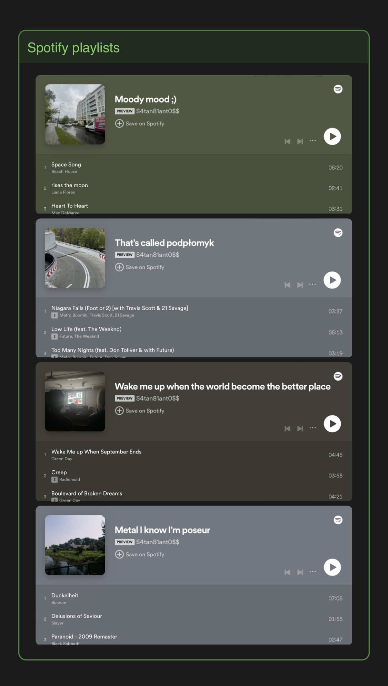
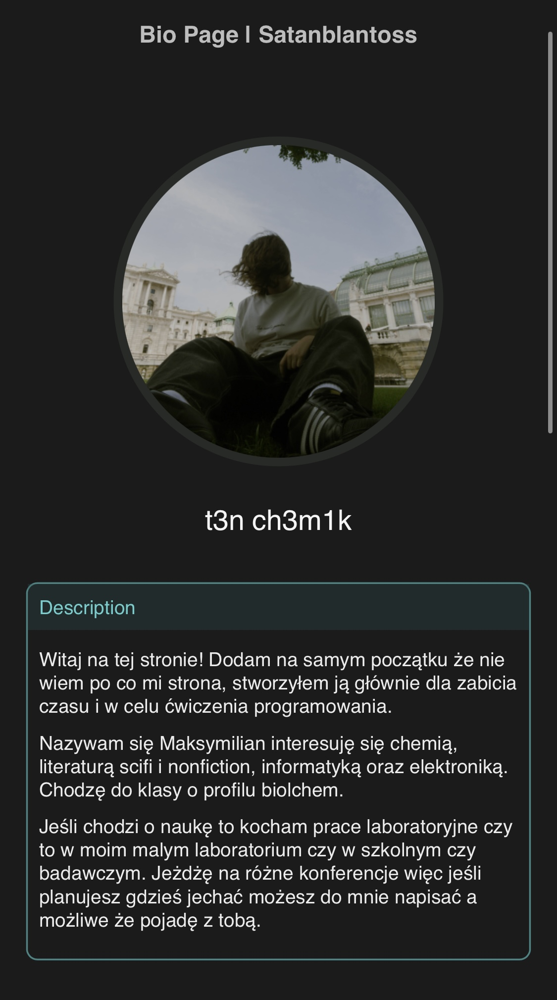
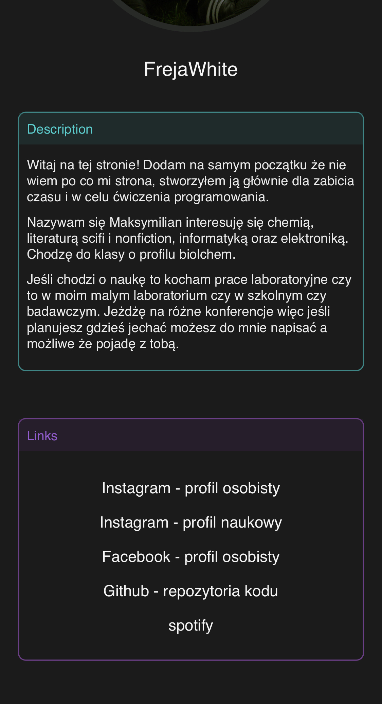

# satanblantoss-Bio-Page

Szybki projekt, który miał na celu stworzenie strony internetowej będącej rozszerzeniem mojego opisu na Instagramie.

## Opis

Projekt `satanblantoss-Bio-Page` to prosta strona internetowa służąca jako rozszerzenie opisu mojego profilu na Instagramie. Strona zawiera dodatkowe informacje oraz multimedia, które nie mieszczą się w ograniczonej przestrzeni profilu na Instagramie.

## Zrzuty ekranu

<p style="display: flex; gap: 10px; ">



</p>

## Funkcjonalności

- Prezentacja szczegółowego opisu użytkownika
- Odnośniki do profili na innych platformach
- Sekcja stworzonych przeze mnie playlist na platformie Spotify

## Technologie

Projekt został zbudowany z użyciem następujących języków:

- HTML
- CSS
- JavaScript

## Instalacja

Aby uruchomić projekt lokalnie, wykonaj następujące kroki:

1. Sklonuj repozytorium:
    ```bash
    git clone https://github.com/whatkindofmilkuare/satanblantoss-Bio-Page.git
    ```

2. Przejdź do katalogu projektu:
    ```bash
    cd satanblantoss-Bio-Page
    ```

3. Otwórz plik `index.html` w przeglądarce.

## Użycie

Po otwarciu pliku `index.html` w przeglądarce, zobaczysz stronę z dodatkowym opisem i multimediami, które można przeglądać.

## Licencja

Ten projekt jest licencjonowany na podstawie licencji MIT.
Przeznaczony jest to użytku publicznego. Można wykorzystać go jako szablon dla swojego rozszerzenia opisu na Instagramie.
